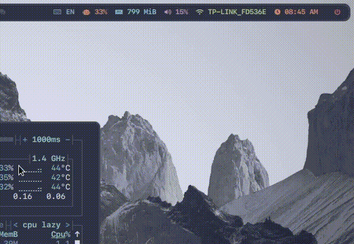

# Ibus module for polybar

- Trigger via polybar-msg



```bash
git clone https://github.com/thanhvule0310/ibus-polybar-module
```

```bash
cp ibus-polybar-module/* ~/.config/polybar/scripts/
```

### First: Custom for yourself

- You need to define your ibus engine at ibus_toggle.sh and ibus.sh
  - Show list ibus engine available via command : `ibus list-engine`
  - ```bash
      ENGLISH="xkb:us::eng"
      VIETNAM="Bamboo"
    ```
  - ```bash
      if [[ "$engine" == "$ENGLISH" ]]; then
          echo "EN" # <- Display on polybar
      else
          echo "VI" # <- Display on polybar
      fi
    ```

Append to polybar.conf (or something simular like modules.conf)

```ini
[module/ibus]
type = custom/ipc
hook-0 = ~/.config/polybar/scripts/ibus.sh
format-prefix = "  "
format-prefix-font = 2
format-prefix-foreground = ${color.blue}
format-prefix-background = ${color.background}
format-background = ${color.background}
format-foreground = ${color.blue}
click-left = ~/.config/polybar/scripts/ibus_toggle.sh &
click-right = ~/.config/polybar/scripts/ibus_toggle.sh &

[module/ibus-trigger]
type = custom/script
exec = polybar-msg hook ibus 1 &>/dev/null
interval = 600
```

Add to bar

```ini
modules-left =
modules-center =
modules-right = ibus ibus-trigger
```

- Key binding to file ibus_toggle.sh if you want to use the shortcut.
